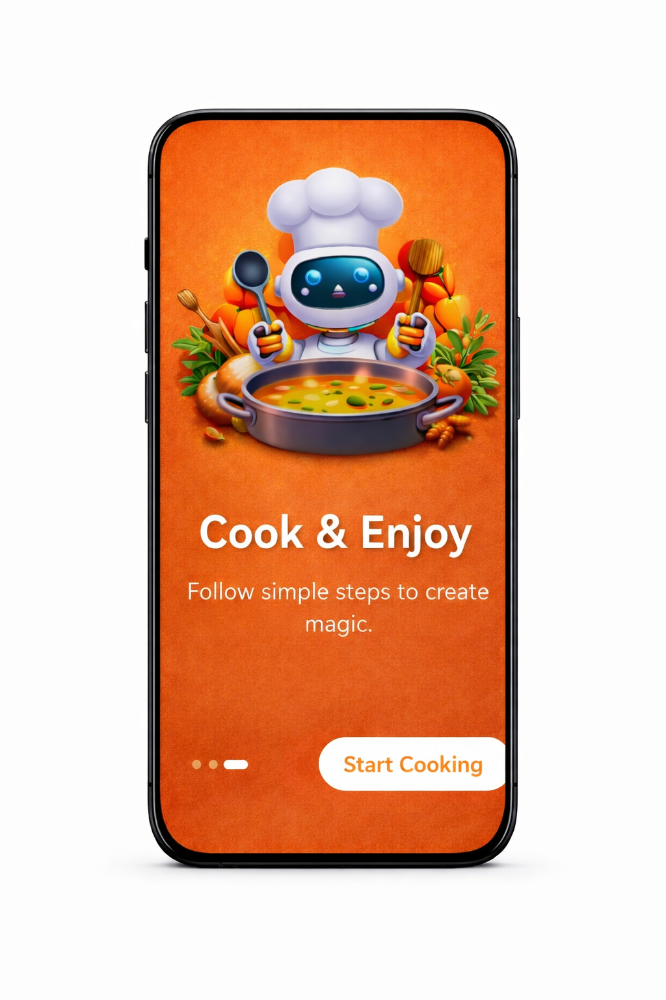
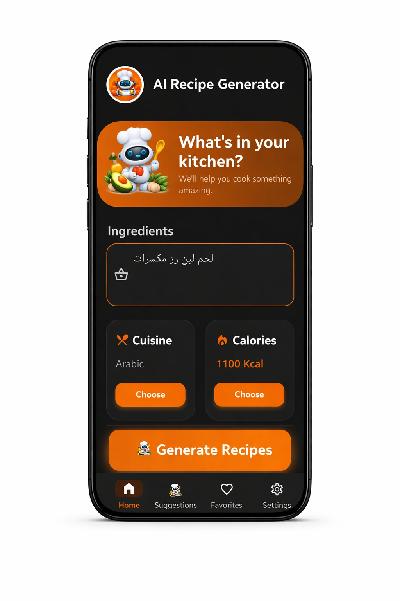
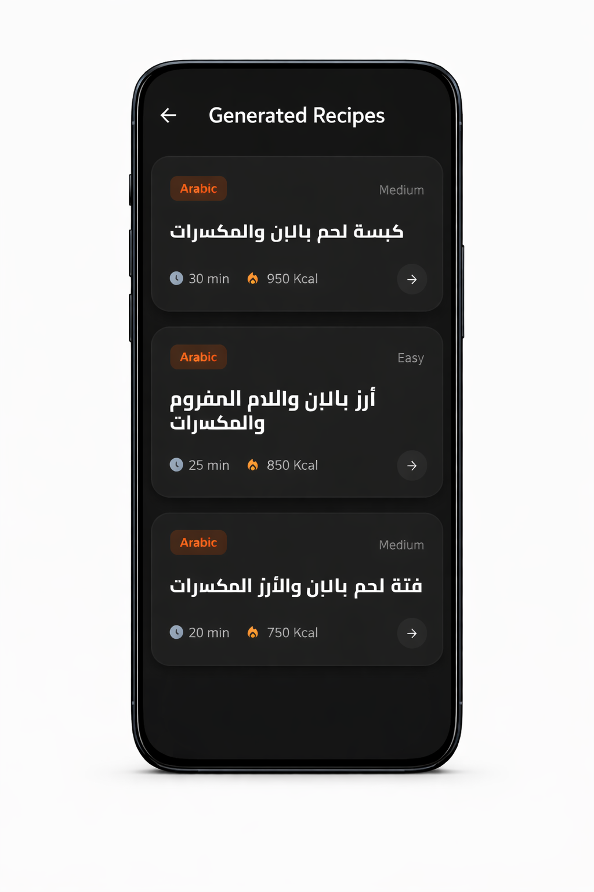
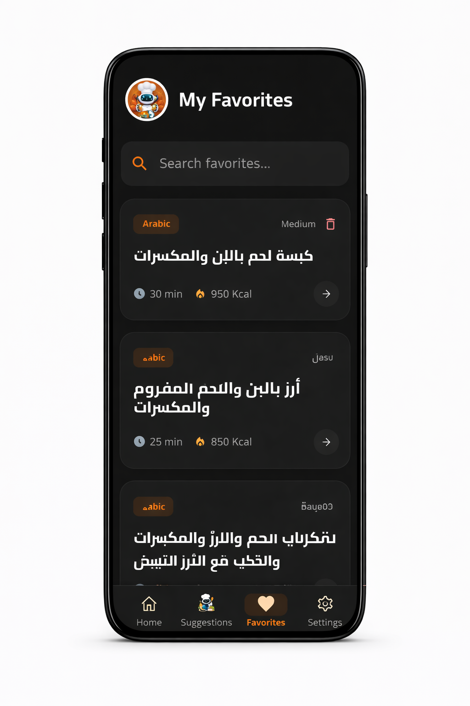
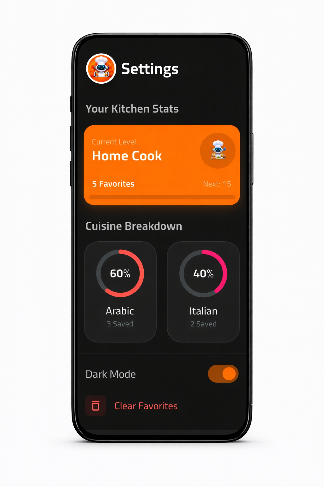

# AI Recipe Generator

<div align="center">
  
  <br />
  <h3>Generate delicious recipes with the power of AI</h3>
  <br />

  <!-- Main Tech Stack -->
  
  
  

  <br />
  <p>Built with the tools and technologies:</p>

  <!-- Secondary Stack -->
  
  
  
</div>

---

## 📋 Table of Contents

- [Overview](#overview)
- [Why AI Recipe Generator?](#why-ai-recipe-generator)
- [Key Features](#key-features)
- [Architecture](#architecture)
    - [Tech Stack](#tech-stack)
- [Getting Started](#getting-started)
    - [Prerequisites](#prerequisites)
    - [Installation](#installation)
- [Usage](#usage)
- [Project Structure](#project-structure)
    - [Key Components](#key-components)
- [Screenshots](#screenshots)
- [Contributing](#contributing)
- [License](#license)

---

## 📖 Overview

**AI Recipe Generator** is a smart cooking companion app built with Flutter. It helps users discover new recipes based on the ingredients they have at home. By leveraging advanced AI, it generates detailed recipes complete with instructions, cooking time, and difficulty levels, tailored to your preferences.

## 🚀 Why AI Recipe Generator?

Cooking should be fun, not a chore. Often we find ourselves staring at a fridge full of ingredients with no idea what to make. **AI Recipe Generator** solves this by:
- **Reducing Food Waste:** Use what you already have.
- **Saving Time:** No need to browse through endless recipe blogs.
- **Personalization:** Get recipes that fit your specific dietary needs and cuisine preferences.

## ✨ Key Features

- **AI-Powered Generation:** Instantly generate unique recipes based on ingredients.
- **Smart Suggestions:** Get personalized recipe ideas based on your history and preferences.
- **Save Favorites:** Keep your best discoveries saved locally for offline access.
- **Detailed Instructions:** Step-by-step cooking guides with timing and difficulty.
- **PDF Export:** Share or print recipes easily.
- **Dark/Light Mode:** Beautiful UI that adapts to your system theme.

---

## 🏗️ Architecture

The application follows **Clean Architecture** principles to ensure separation of concerns, scalability, and testability.

### Tech Stack

- **Framework:** [Flutter](https://flutter.dev/)
- **Language:** [Dart](https://dart.dev/)
- **State Management:** [Riverpod](https://riverpod.dev/)
- **Networking:** [Dio](https://pub.dev/packages/dio)
- **Local Storage:** [Hive](https://docs.hivedb.dev/)
- **Animations:** [Flutter Animate](https://pub.dev/packages/flutter_animate) & [Lottie](https://pub.dev/packages/lottie)
- **Code Generation:** [Freezed](https://pub.dev/packages/freezed) & [JSON Serializable](https://pub.dev/packages/json_serializable)
- **PDF Generation:** [pdf](https://pub.dev/packages/pdf) & [printing](https://pub.dev/packages/printing)

---

## 🏁 Getting Started

Follow these instructions to get a copy of the project up and running on your local machine.

### Prerequisites

- [Flutter SDK](https://docs.flutter.dev/get-started/install) (latest stable version)
- [Dart SDK](https://dart.dev/get-dart)
- An API Key for the AI service (e.g., Gemini)

### Installation

1. **Clone the repository**
   ```bash
   git clone https://github.com/yourusername/ai_recipe_generator.git
   cd ai_recipe_generator
   ```

2. **Install dependencies**
   ```bash
   flutter pub get
   ```

3. **Run Code Generator**
   ```bash
   dart run build_runner build --delete-conflicting-outputs
   ```

4. **Run the App**
   ```bash
   flutter run
   ```

---

## 📱 Usage

1. **Onboarding:** Complete the initial setup to verify your preferences.
2. **Input Ingredients:** Enter the items you have in your kitchen.
3. **Generate:** Tap "Create Recipe" and watch the magic happen.
4. **View & Save:** Browse the generated recipe details and save it to your Favorites.
5. **Suggestions:** Check the "Suggestions" tab for daily inspiration.

---

## 📂 Project Structure

```
lib/
├── core/           # Core utilities, theme, and shared widgets
├── data/           # Data layer (API calls, local database implementation)
├── domain/         # Domain layer (Entities, Use Cases, Repository Interfaces)
├── presentation/   # UI layer (Screens, Widgets, Riverpod Providers)
└── main.dart       # App entry point
```

### Key Components

- **Providers:** Managed using Riverpod for dependency injection and state management.
- **Services:** 
  - `RecipeRemoteDataSource`: Handles AI API communication.
  - `RecipeLocalDataSource`: Manages Hive database storage.

---

## 📸 Screenshots

| Splash Screen | Onboarding | Home Screen |
|:---:|:---:|:---:|
|  |  |  |

| Suggestions | Generated Recipe | Favorites |
|:---:|:---:|:---:|
|  |  |  |

<div align="center">
  <p><strong>Settings Screen</strong></p>
  
</div>

---

## 🤝 Contributing

Contributions are welcome! Please feel free to submit a Pull Request.

1. Fork the project
2. Create your feature branch (`git checkout -b feature/AmazingFeature`)
3. Commit your changes (`git commit -m 'Add some AmazingFeature'`)
4. Push to the branch (`git push origin feature/AmazingFeature`)
5. Open a Pull Request

---

## 📄 License

This project is licensed under the MIT License - see the [LICENSE](LICENSE) file for details.
